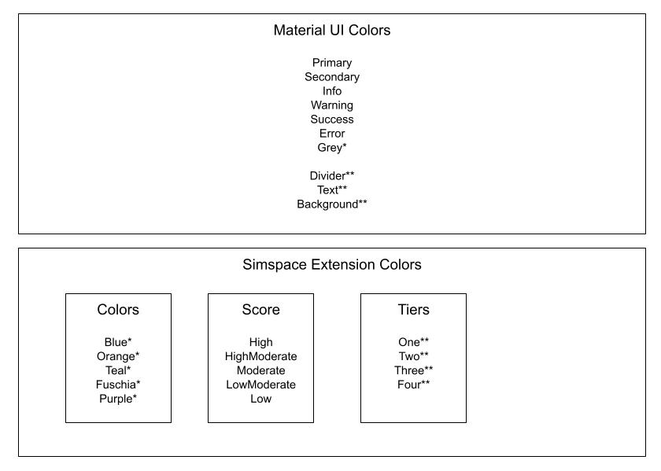

# Colors in Monorail



## Concepts

### Material UI Colors

#### Brand Specific colors

**Primary** / **Secondary** are brand-specific colors. They change depending on the client that is using our platform, for example:
  1. With Simspace branding, primary is #1465FF, and secondary is #161C4F
  2. With PCTE Branding, primary is: #4A235E secondary is: ???

#### Global MUI Colors
  1. Success / error / warning / info are global MUI colors. They are static across clients. And are typically some shade of green, red, yellow, blue, respectively
  2. Also included in "Global MUI colors" are: greys / background / text

#### Simspace Extension Colors:
Simspace provides extensions on top of the normal Material UI colors, these are separated into 3 different color buckets:

  1. Colors
    - Colors are a bucket of semantically-named colors which can be altered per theme. Their type is "`Color`", meaning they can have a range of value from `50-900`
    `A100-A700`. The colors include: **Blue**, **Orange**, **Teal**, **Fuschia**, **Purple**.
  2. Score
    - Used to indicate a score, includes 5 levels: **High**, **HighModerate**, **Moderate**,  **LowModerate**, **Low**.
  3. Tiers
    - Typically used as color-coding items/layers in graphs. These are static colors, and don't include a range: **One**, **Two**, **Three**, **Four**.

#### Map of all colors:

- A `Color` is a set of values containing:
  - 50,100,200,300,400,500,600,700,800,900,A100,A200,A400,A700
- A `PaletteColor` is a set of values containing:
  - light, main, dark
- Other custom colors contain their own structure, and are specified below. `string` refers to an _actual_ color.

```
{
  primary: PaletteColor
  secondary: PaletteColor
  error: PaletteColor
  warning: PaletteColor
  info: PaletteColor
  success: PaletteColor
  grey: Color
  text: {
    primary: string;
    secondary: string;
    disabled: string;
  }
  divider: string
  background: {
    default: string;
    paper: string;
  }

  colors: {
    blue: Color
    orange: Color
    teal: Color
    fuschia: Color
    purple: Color
  }

  score: {
    high: PaletteColor
    highModerate: PaletteColor
    moderate: PaletteColor
    lowModerate: PaletteColor
    low: PaletteColor
  }

  tiers: {
    one: string,
    two: string,
    three: string,
    four: string
  }
}
```

These colors can be referenced by their path, i.e. `score.highModerate`, `tiers.one`, `primary`, `secondary`. 

## Development

### Design Development:
Designs will need to reference the _Semantic name_ of a color. In development, figma sketches can use a specific color scheme (with specific hex values), but will need to be noted with what semantic color the hex specifies.

### UI FE Development:
Specifying colors outside of monorail components is expected to be atypical, however, whenever necessary it's of pivotal importance that a UI uses a color by it's semantic name, and through the theme. This is to ensure that when themes change, usages are updated automatically.
